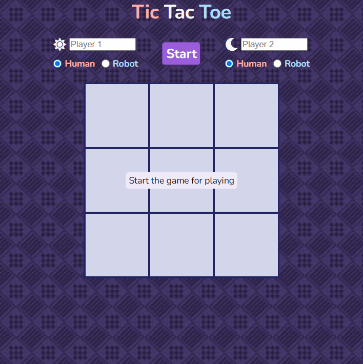
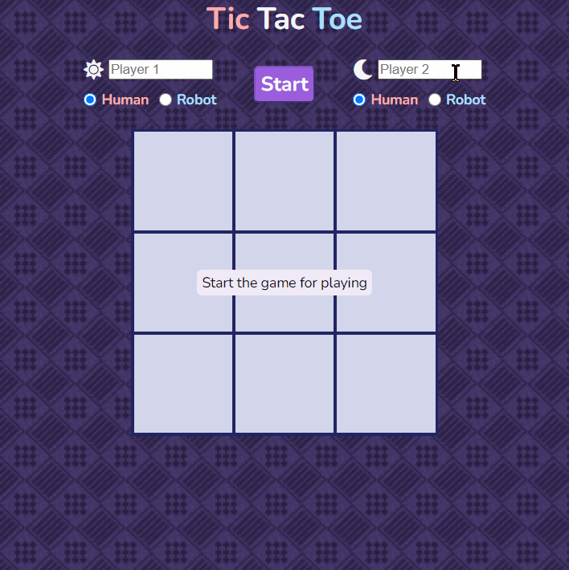
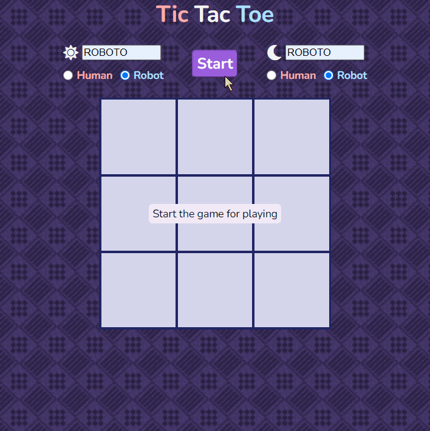

# tic-tac-toe

<h2 align="center"><a  href="https://aurelien-genois.github.io/tic-tac-toe/">Live Demo</a></h2>

## Description
The [sixth Odin project](https://www.theodinproject.com/paths/full-stack-javascript/courses/javascript/lessons/tic-tac-toe) is a tic-tac-toe game for practice JavaScript, specially factory functions and the module pattern (not the ES6 modules).

## Features

- The user plays on the browser
- Can play with two human players
- The players points are update after each round
- The current player name is highlight in white

 
 

- The user chooses if a player is a robot or a human
- Can play against a robot (random moves)
- Can custom the names of both human or robot players
- The player names are accompagned with their marker and are in a reddish color (if human) or bluich color (if robot)

 
 

- Two robots can play against each other 
- The name can be the same
- The result of the last 4 rounds are displayed
- The fifth last round disappears

## Challenges
The goal was to organize methods by separating them into logical modules. There is one factory function to create the two player objects and three modules : 
- one module to manage the gameboard represented by an array
- one module to contain the game logic (who plays, how he plays, check if he wins)
- one module to manipulate the DOM (display the gameboard, the markers and the results, toggle a mask to prevent click during robot delay...)

Factory functions and modules allow to define methods as private or public by returning in an object only the methods we want to be accessible by external code (in particular by other modules). It is very useful to keep the logic separately of each modules while making  each module working together, it prevents naming confusion and make the code more understandable and maintainable.

Organizing the code in public/private methods was specially instructive with the second module (the game logic). *aiPlay* and *humanPlay* are two public methods which both call the same private method *_playAMove*. The latter controls the turn change between the two players, and calls the other private method *_setAMove* for each one. *_playAMove* also calls *aiPlay* if the other player is a robot, with a delay (a *setTimeout*) so when both players are robots we can watch them play (the final result is not immediately displayed). 

Besides the logic to manage each player turn and their two different behaviors (the human and the robot), making the robot to play a random move was also instructing because it requires to select only the empty cells for choosing a random cell among them. A similar condition is used in the *humanPlay* methods, preventing to set a move in a cell which already contains a marker.
